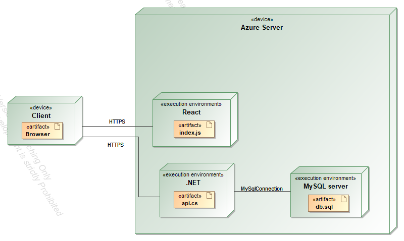

# Project description

Project goal - create a web app for registering computers to repair shops\
Software consists of 3 objects - shop, computer and part which are linked through a hierarchical connection:\
Shop -> Computer -> Part\
There are three user roles - admin, employee and a regular user.\
Regular users can:
* View shop list
* Register a computer for a specified shop
* Check own computer status

Employees can:
* View all computers
* Add or delete parts for computers

Admins can:
* Add or delete shops
* Delete computers
* Delete parts

# System architecture

The system consists of the following components:\
Back-end, used technology - .NET\
Front-end, used technology - React\
Database, used technology - MySQL (local), Microsoft SQL Server (deployed)



# API documentation

## Shops

### Get list

```http
GET /shops
```
Returns all shops in the database\
Potential response codes: 200, 404\
Example response:
```
{
  "id": 0,
  "address": "string",
  "city": "string"
}
```

### Get single

```http
GET /shops/{id}
```
Returns specified shop\
Potential response codes: 200, 404\
Example response:
```
{
  "id": 0,
  "address": "string",
  "city": "string"
}
```

### Get shop computers

```http
GET /shops/{id}/computers
```
Returns all computers belonging to specified shop\
Potential response codes: 200, 404\
Example response:
```
{
  "id": 0,
  "userId": 0,
  "shopId": 0,
  "name": "string",
  "registered": "2022-10-06T18:51:32.189Z"
}
```

### Get single shop computers

```http
GET /shops/{shopId}/computers/{computerId}
```
Returns all computers belonging to specified shop\
Potential response codes: 200, 404\
Example response:
```
{
  "id": 0,
  "userId": 0,
  "shopId": 0,
  "name": "string",
  "registered": "2022-10-06T18:51:32.189Z"
}
```

### Get shop computer parts

```http
GET /shops/{shopId}/computers/{computerId}/parts
```
Returns all parts belonging to specified computer in a specified shop\
Potential response codes: 200, 404\
Example response:
```
{
  "id": 0,
  "computerId": 0,
  "type": "string",
  "name": "string"
}
```

### Post

```http
POST /shops
```
Inserts new item to database. Example request body:
```
{
  "id": 0,
  "address": "string",
  "city": "string"
}
```
Potential response codes: 201\
Example response:
```
{
  "id": 0,
  "address": "string",
  "city": "string"
}
```

### Put

```http
PUT /shops
```
Updates item in the database. Example request body:
```
{
  "id": 0,
  "address": "string",
  "city": "string"
}
```
Potential response codes: 201, 200\
Example response:
```
{
  "id": 0,
  "address": "string",
  "city": "string"
}
```

### Delete

```http
DELETE /shops/{id}
```
Deletes specified shop\
Potential response codes: 204

## Computers

### Get list

```http
GET /computers
```
Returns all computers in the database\
Potential response codes: 200, 404\
Example response:
```
{
  "id": 0,
  "userId": 0,
  "shopId": 0,
  "name": "string",
  "registered": "2022-10-06T18:51:32.189Z"
}
```

### Get single

```http
GET /computers/{id}
```
Returns specified computer\
Potential response codes: 200, 404\
Example response:
```
{
  "id": 0,
  "userId": 0,
  "shopId": 0,
  "name": "string",
  "registered": "2022-10-06T18:51:32.189Z"
}
```

### Post

```http
POST /computers
```
Inserts new item to database. Example request body:
```
{
  "id": 0,
  "userId": 0,
  "shopId": 0,
  "name": "string",
  "registered": "2022-10-06T18:51:32.189Z"
}
```
Potential response codes: 201\
Example response:
```
{
  "id": 0,
  "userId": 0,
  "shopId": 0,
  "name": "string",
  "registered": "2022-10-06T18:51:32.189Z"
}
```

### Put

```http
PUT /computers
```
Updates item in the database. Example request body:
```
{
  "id": 0,
  "userId": 0,
  "shopId": 0,
  "name": "string",
  "registered": "2022-10-06T18:51:32.189Z"
}
```
Potential response codes: 201, 200\
Example response:
```
{
  "id": 0,
  "userId": 0,
  "shopId": 0,
  "name": "string",
  "registered": "2022-10-06T18:51:32.189Z"
}
```

### Delete

```http
DELETE /computers/{id}
```
Deletes specified computer\
Potential response codes: 204

## Parts

### Get list

```http
GET /parts
```
Returns all parts in the database\
Potential response codes: 200, 404\
Example response:
```
{
  "id": 0,
  "computerId": 0,
  "type": "string",
  "name": "string"
}
```

### Get single

```http
GET /parts/{id}
```
Returns specified part\
Potential response codes: 200, 404\
Example response:
```
{
  "id": 0,
  "computerId": 0,
  "type": "string",
  "name": "string"
}
```

### Post

```http
POST /parts
```
Inserts new item to database. Example request body:
```
{
  "id": 0,
  "computerId": 0,
  "type": "string",
  "name": "string"
}
```
Potential response codes: 201\
Example response:
```
{
  "id": 0,
  "computerId": 0,
  "type": "string",
  "name": "string"
}
```

### Put

```http
PUT /parts
```
Updates item in the database. Example request body:
```
{
  "id": 0,
  "computerId": 0,
  "type": "string",
  "name": "string"
}
```
Potential response codes: 201, 200\
Example response:
```
{
  "id": 0,
  "computerId": 0,
  "type": "string",
  "name": "string"
}
```

### Delete

```http
DELETE /parts/{id}
```
Deletes specified part\
Potential response codes: 204
